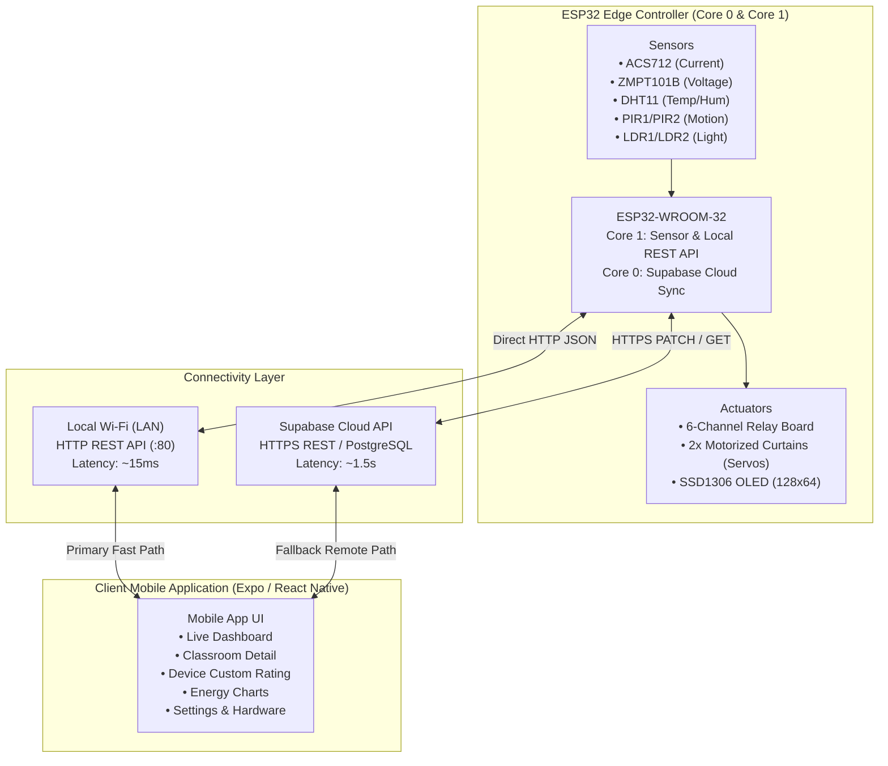
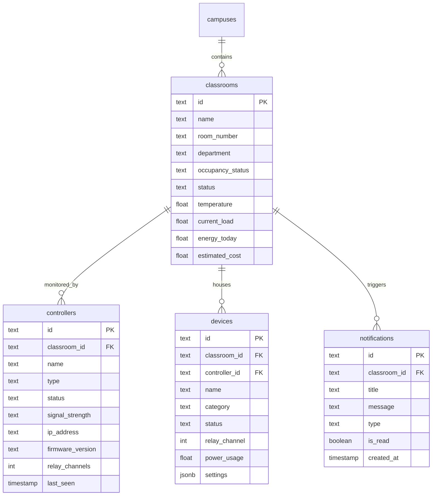

# NBA Smart Classroom Automation System
## Technical Architecture, Firmware, and Application Documentation

---

### Table of Contents
1. [Executive Overview](#1-executive-overview)
2. [High-Level System Architecture](#2-high-level-system-architecture)
3. [Dual-Path Communication Workflow (LAN vs. Cloud)](#3-dual-path-communication-workflow)
4. [ESP32 Firmware Architecture](#4-esp32-firmware-architecture)
   - [Pin Mapping & Hardware Specs](#pin-mapping--hardware-specs)
   - [FreeRTOS Dual-Core Task Allocation](#freertos-dual-core-task-allocation)
   - [AC Power & Energy Metering Engine](#ac-power--energy-metering-engine)
   - [Hardware Protection Mechanisms](#hardware-protection-mechanisms)
   - [Local REST API Endpoints](#local-rest-api-endpoints)
5. [React Native / Expo Mobile Application](#5-react-native--expo-mobile-application)
   - [State Management & Lifecycle](#state-management--lifecycle)
   - [Screen & Component Hierarchy](#screen--component-hierarchy)
   - [Custom Appliance Power Rating Engine](#custom-appliance-power-rating-engine)
6. [Cloud Database Architecture (Supabase)](#6-cloud-database-architecture-supabase)
7. [Complete Hardware Wiring Diagram](#7-complete-hardware-wiring-diagram)
8. [Setup & Deployment Guide](#8-setup--deployment-guide)

---

### 1. Executive Overview

The **NBA Smart Classroom Automation System** (`NBA_SCR_App`) is an IoT solution designed for multi-zone educational institutions. It provides:
- **Intelligent Occupancy-Driven Automation:** Autonomous control of lighting, ventilation (fans), and motorized curtains using PIR motion sensors, ambient temperature (DHT11/DHT22), and corridor illumination (LDRs).
- **Physical AC Energy & Power Telemetry:** Real-time root-mean-square (RMS) AC mains voltage and current measurements for Classroom A101 via dedicated analog sensors (ZMPT101B and ACS712).
- **Riemann Sum Energy Accumulation:** Continuous power integration calculating kilowatt-hours (kWh) and estimated operational costs, saved into Non-Volatile Storage (NVS) flash memory.
- **Cross-Platform Mobile Management:** A React Native application built with Expo providing control, customizable device ratings, energy analytics, and hardware health diagnostics.

---

### 2. High-Level System Architecture



---

### 3. Dual-Path Communication Workflow

The system employs a **Hybrid Dual-Path** networking approach to balance instant response time with universal remote accessibility:

```
                    +------------------------------------+
                    |        User Taps Appliance         |
                    |       in Mobile Application        |
                    +-----------------+------------------+
                                      |
                     [ Is ESP32 reachable over LAN? ]
                                     / \
                             YES    /   \   NO
                                   /     \
                                  v       v
         +----------------------------+   +-----------------------------+
         |     PATH A (Local LAN)     |   |    PATH B (Cloud Fallback)  |
         |----------------------------|   |-----------------------------|
         | • Sends HTTP POST directly |   | • Updates Supabase Database |
         |   to http://<esp32-ip>/ctrl|   |   (devices table status=on) |
         | • Latency: ~10-25ms        |   | • Latency: ~1-2 seconds     |
         | • Zero cloud dependency    |   | • Global cellular reach     |
         +--------------+-------------+   +--------------+--------------+
                        |                                |
                        |     +--------------------+     |
                        +---->| ESP32 Actuates Pin |<----+
                              |  (Physical Relay)  |
                              +--------------------+
```

1. **Path A — Direct Local LAN (Primary Fast Path):**
   - Active when the mobile phone and ESP32 are connected to the same Wi-Fi router.
   - The app dispatches lightweight JSON POST commands directly to the ESP32 IP on port 80.
   - Response time is nearly instantaneous (10–25 ms), ideal for physical classroom interaction.
2. **Path B — Supabase Cloud Sync (Universal Remote Fallback):**
   - Active when operating remotely via cellular data (4G/5G) or outside the local router.
   - The mobile app updates the `devices` table in Supabase.
   - The ESP32's background task (`supabaseCloudTask`) polls Supabase, identifies state changes, and synchronizes the relays.

---

### 4. ESP32 Firmware Architecture

#### Pin Mapping & Hardware Specs

| Peripheral / Component | ESP32 GPIO | Pin Type | Notes |
| :--- | :--- | :--- | :--- |
| **OLED SDA** | GPIO 21 | I2C Data | SSD1306 128x64 display |
| **OLED SCL** | GPIO 22 | I2C Clock | SSD1306 128x64 display |
| **DHT11 / DHT22 Data** | GPIO 4 | Digital In/Out | 2.5s non-blocking interval |
| **PIR 1 (Classroom A101)** | GPIO 32 | Digital Input | ADC1 safe, hardware debounce |
| **PIR 2 (Classroom A102)** | GPIO 33 | Digital Input | ADC1 safe, hardware debounce |
| **LDR 1 (Corridor 1)** | GPIO 34 | Analog In (ADC1) | Wi-Fi safe input |
| **LDR 2 (Corridor 2)** | GPIO 35 | Analog In (ADC1) | Wi-Fi safe input |
| **ACS712 Current Sensor** | GPIO 36 (SENSOR_VP) | Analog In (ADC1) | Dedicated A101 AC current |
| **ZMPT101B Voltage Sensor** | GPIO 39 (SENSOR_VN) | Analog In (ADC1) | Dedicated A101 AC voltage |
| **Servo 1 (A101 Curtains)**| GPIO 18 | PWM Output | 0° closed, 80° open |
| **Servo 2 (A102 Curtains)**| GPIO 19 | PWM Output | 0° closed, 80° open |
| **Relay 1 (A101 Light)** | GPIO 25 | Digital Output | Active-LOW, staggered startup |
| **Relay 2 (A101 Fan)** | GPIO 27 | Digital Output | Active-LOW, staggered startup |
| **Relay 3 (A102 Light)** | GPIO 26 | Digital Output | Active-LOW, staggered startup |
| **Relay 4 (A102 Fan)** | GPIO 14 | Digital Output | Active-LOW, staggered startup |
| **Relay 5 (Corridor 1 Light)**| GPIO 16 | Digital Output | Active-LOW, staggered startup |
| **Relay 6 (Corridor 2 Light)**| GPIO 17 | Digital Output | Active-LOW, staggered startup |

#### FreeRTOS Dual-Core Task Allocation
- **Core 0 (Cloud Task):** Runs `supabaseCloudTask` with 16KB dedicated stack. Handles HTTPS TLS handshakes, payload serialization, Supabase polling, and telemetry without causing latency on Core 1.
- **Core 1 (Real-Time Control):** Runs the primary Arduino `loop()`, high-speed analog RMS sensor sampling, physical relay switching, servo PWM actuation, and local HTTP REST server.

#### AC Power & Energy Metering Engine
Classroom A101 features an AC RMS sampling routine (`sampleA101PowerMeter()`):
1. **RMS Waveform Integration:** Collects 400 analog samples across multiple 50Hz mains AC cycles (40ms). Calculates standard deviation around the DC quiescent offset.
2. **Noise Gate Rejection:**
   - Readings below `60.0V` are clamped to zero (filters open-circuit 50Hz electromagnetic coupling on high-gain ZMPT101B amplifiers).
   - Current readings below `0.09A` are clamped to zero (filters Hall-effect thermal drift and baseline switching noise).
3. **Active Power & Riemann Integration:**
   - Active Power: $P = V_{RMS} \times I_{RMS} \times \text{PF}$ (default Power Factor = 0.95).
   - Energy Accumulation: $E_{(kWh)} = E_{(kWh)} + \left(\frac{P_{(W)}}{1000} \times \Delta t_{(h)}\right)$.
   - Accumulated values persist into NVS flash every 5 minutes and reset automatically at midnight.

#### Hardware Protection Mechanisms
- **Brownout Detector Disabled on Boot:** `WRITE_PERI_REG(RTC_CNTL_BROWN_OUT_REG, 0)` eliminates spurious ESP32 resets from momentary inductor/relay coil inrush dips.
- **Staggered Relay Actuation:** `applyRelayStates()` implements state caching and 15ms sequential switching delays to prevent simultaneous current draw spikes.
- **Servo Thermal Protection:** After curtain movement completes, the servo PWM signal detaches after an 800ms idle window to eliminate buzzing and gear fatigue.

#### Local REST API Endpoints
- `GET /` — Healthcheck returning system name, status, and firmware version.
- `GET /status` or `GET /api/status` — Returns full system JSON telemetry including real-time voltages, currents, occupancy, device states, and active Wi-Fi SSID.
- `GET /ctrl?dev=<id>&st=<0|1>` or `POST /api/control` — Switches physical devices with support for `{"deviceId":"...", "state": true}`.
- `GET /mode?auto=<0|1>` or `POST /api/mode` — Toggles between autonomous PIR/LDR automation and manual override mode.
- `GET /config` — Queries or updates operational thresholds (temperature limits, hold timers, and rated wattages).

---

### 5. React Native / Expo Mobile Application

#### State Management & Lifecycle ([`context/AppContext.tsx`](file:///c:/Users/Ashil/Desktop/NBA%20Project/NBA_SCR_App/context/AppContext.tsx))
- **Unified Central State:** Manages campuses, classrooms, connected devices, active alerts, notifications, and real-time telemetry.
- **Auto Controller Discovery:** Detects ESP32 on the local subnet via configurable IP, testing connection health every 3 seconds.
- **Dynamic SSID Telemetry:** Captures `esp32Telemetry.ssid` directly from the firmware status payload and dynamically displays the active network in Settings.

#### Screen & Component Hierarchy
- **Home Dashboard ([`app/(tabs)/index.tsx`](file:///c:/Users/Ashil/Desktop/NBA%20Project/NBA_SCR_App/app/%28tabs%29/index.tsx)):**
  - `HomeHeader`: Campus name, department, profile avatar, and unread notification badge.
  - `EnergyOverviewCard`: Today's accumulated kWh, instantaneous active wattage load, and online device count.
  - `Esp32LiveBar`: Real-time hardware status capsule displaying LAN vs. Cloud mode, controller IP, and configuration modal.
  - `QuickControls`: One-tap controls for All Lights, All Fans, All Curtains, Auto/Manual mode toggle, and Emergency Off.
  - `ClassroomCard`: Multi-room cards displaying occupancy, temperature, power load, and quick relay toggles.
- **Classroom Detailed View ([`app/classroom/[id].tsx`](file:///c:/Users/Ashil/Desktop/NBA%20Project/NBA_SCR_App/app/classroom/%5Bid%5D.tsx)):**
  - Classroom A101 AC Power Telemetry card displaying real-time Mains RMS Voltage, Load RMS Current, and Active Power.
  - Device grid with toggle switches and rated power badges.
- **Device Detailed Screen ([`app/device/[id].tsx`](file:///c:/Users/Ashil/Desktop/NBA%20Project/NBA_SCR_App/app/device/%5Bid%5D.tsx)):**
  - Nameplate Rated Power Specification editor with quick presets (e.g., 40W, 60W, 75W, 100W) and custom step increment buttons.
  - Physical action buttons (*Turn On*, *Turn Off*, *Open*, *Close*).
  - ESP32 hardware pin diagnostics mapping the device to its physical relay/servo channel.
- **Energy Analytics Dashboard ([`app/(tabs)/energy.tsx`](file:///c:/Users/Ashil/Desktop/NBA%20Project/NBA_SCR_App/app/%28tabs%29/energy.tsx)):**
  - Interactive bar charts for Hourly (24h time-series from ESP32 telemetry), Daily (7-day week), and Weekly energy consumption.
  - Energy ranking and cost breakdown.
- **Settings & Hardware ([`app/(tabs)/settings.tsx`](file:///c:/Users/Ashil/Desktop/NBA%20Project/NBA_SCR_App/app/%28tabs%29/settings.tsx)):**
  - Live hardware specs, dynamic Wi-Fi SSID, firmware version, and institution details.

#### Custom Appliance Power Rating Engine
- Users can customize the rated power of any appliance directly in [`app/device/[id].tsx`](file:///c:/Users/Ashil/Desktop/NBA%20Project/NBA_SCR_App/app/device/%5Bid%5D.tsx).
- Saved ratings immediately synchronize across three tiers:
  1. **Local Persistent Cache:** Persisted to `@smart_classroom_rated_power_map` via `AsyncStorage`.
  2. **Active Runtime State:** Classroom `currentLoad` recalculates across the Home screen, Classroom cards, and Energy overview.
  3. **Cloud & Controller Synchronization:** Updated to Supabase (`devices.settings.ratedPower`) and pushed to ESP32 flash memory (`/config?c1_light_w=...`).

---

### 6. Cloud Database Architecture (Supabase)



---

### 7. Complete Hardware Wiring Diagram

```
                              +--------------------+
                              |   ESP32-WROOM-32   |
                              +--------------------+
                                |    |    |    |
        +-----------------------+    |    |    +-----------------------+
        |                            |    |                            |
  [ GPIO 21 / 22 ]             [ GPIO 4 ] |                      [ GPIO 36 / 39 ]
        |                            |    |                            |
        v                            v    v                            v
 +---------------+             +-------+  |                      +---------------+
 |  SSD1306 OLED |             | DHT11 |  |                      | ACS712 / ZMPT |
 | (SDA/SCL I2C) |             | Climate| |                      | Energy Meter  |
 +---------------+             +-------+  |                      +---------------+
                                          |
                +-------------------------+-------------------------+
                |                                                   |
         [ GPIO 32 / 33 ]                                    [ GPIO 34 / 35 ]
                |                                                   |
                v                                                   v
      +-------------------+                               +-------------------+
      | PIR Motion (1 & 2)|                               | LDR Light (1 & 2) |
      | Classroom Presence|                               | Corridor Ambient  |
      +-------------------+                               +-------------------+
                |
                +-------------------------+
                |                         |
         [ GPIO 18 / 19 ]          [ GPIO 25, 27, 26, 14, 16, 17 ]
                |                         |
                v                         v
      +-------------------+      +---------------------------------+
      | Servos (Curtains) |      | 6-Channel Relay Board           |
      | 0° Open / 80° Shut|      | In1: C1 Light    In4: C2 Fan    |
      +-------------------+      | In2: C1 Fan      In5: Corr 1    |
                                 | In3: C2 Light    In6: Corr 2    |
                                 +---------------------------------+
```

---

### 8. Setup & Deployment Guide

#### 1. Flashing the ESP32 Firmware
1. Open [`firmware/esp32_smart_classroom/esp32_smart_classroom.ino`](file:///c:/Users/Ashil/Desktop/NBA%20Project/NBA_SCR_App/firmware/esp32_smart_classroom/esp32_smart_classroom.ino) in Arduino IDE.
2. Install required Arduino libraries:
   - `ESP32 Board Package` (by Espressif)
   - `ArduinoJson` (v6.x)
   - `Adafruit SSD1306` & `Adafruit GFX`
   - `DHT sensor library`
   - `ESP32Servo`
3. In [`firmware/esp32_smart_classroom/config.h`](file:///c:/Users/Ashil/Desktop/NBA%20Project/NBA_SCR_App/firmware/esp32_smart_classroom/config.h), set your local Wi-Fi credentials:
   ```cpp
   const char *const WIFI_SSID = "YOUR_WIFI_NAME";
   const char *const WIFI_PASSWORD = "YOUR_WIFI_PASSWORD";
   ```
4. Select board **ESP32 Dev Module** and upload the code.
5. Open Serial Monitor at **115200 baud** to view local IP address and sensor calibrations.

#### 2. Running the Mobile Application
1. Install project dependencies:
   ```bash
   npm install
   ```
2. Start the Expo development server:
   ```bash
   npx expo start --tunnel
   ```
3. Open the **Expo Go** application on your iOS or Android device and scan the displayed QR code.
4. Ensure your phone is connected to the same Wi-Fi network for instant local LAN execution. If connected via a different network, the application will automatically manage the classroom via Supabase cloud synchronization.
